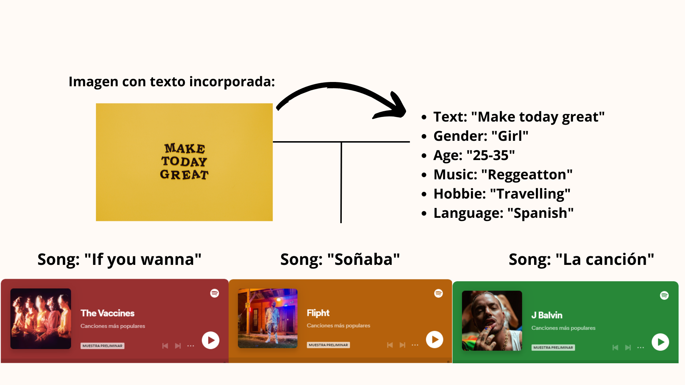

<p align="center" width="100%">
    
</p>

  


# VIBE AI

## INTRODUCCIÓN

**VIBE AI** es la aplicación web capaz de asociar una canción que mejor se identifique
con el usuario adaptando sus características y sus preferencias musicales.  

## FUNCIONAMIENTO

Mediante el ingreso de un formulario, y una serie de características del usuario, **la inteligencia artificial,
ChatGPT**, será capaz de sugerir una canción apropiada para el usuario que mejor se ajuste al contexto en el que la solicita y teniendo en cuenta
sus preferencias musicales.

## PROCESO Y ESTRUCTURA INTERNA

* **23 de Enero de 2023 - Version 1.0**

  - La primera versión recogerá como **input** 2 artistas que más gusten al usuario, para que **ChatGPT** recomiende una lista de 3 artistas, con 3 canciones relacionadas con los 2 primeros artistas.
   
 
 *  **24 de Enero de 2023 - Version 2.0**

     - Creación de un formulario mas detallado, recogiendo como **input**: Un texto o frase inspiradora, género, idioma, ocupación, hobbies y estilo musical favorito.
     - La respuesta de esta petición a **ChatGPT** serán 3 artistas con las canciónes mas adecuadas en base a los campos del formulario rellenados.  
     - Esta nueva versión permitirá inspirar al usuario en su perfil de redes sociales.

*  **24 de Enero de 2023 - Version 2.1**
     - Como futura implemntación, se incorporará un modelo de reconocimiento de imágenes para que el usuario pueda introducir sus imágenes sin necesidad de introducirl manualmente el texto.

## EJEMPLO Version 1:


## EJEMPLO Version 2:


## EJEMPLO Version 2.1:


##  USO

**Vibe IA** funciona de la siguiente forma:

```
import spotipy
from spotipy.oauth2 import SpotifyClientCredentials
import openai
from flask import Flask,jsonify, request
from getpass import getpass
import spotipy
from spotipy.oauth2 import SpotifyOAuth
import openai
```

```
def json_to_python():
    #Hacemos request del json que utilizaremos para introducir un prompt a ChatGPT
    data = request.get_json()
    
    #Extraemos los datos del json para alimentar al prompt correctamente
    text = data['text']
    gender = data['gender']
    ages = data['ages']
    music = data['music']
    hobbie = data['hobbie']
    language = data['language']
    
```

Se realiza el prompt o petición a ChatGPT: 
```
    
    Prompts = (f"Quiero que me des el titulo de una cancion que esté en idioma {language}, con su cantante o grupo, relacionado con el siguiente texto: '{text}'. Recuerda que la cancion deberia estar en Spotify. Ademas de basarte en el texto para relacionar una cancion existente y que sea en idioma {language}, ten en cuenta que es para mi perfil de instagram y las caracteristicas de mis seguidores son los siguientes: son {gender} con edades entre {ages}, que les gusta la musica {music},especialmente {music}, y mi instagram se basa en actividad de {hobbie}. Basándote en el siguiente texto ' {text} ', y en las características de mis seguidores que te he dicho,tienes que devolverme el titulo de una cancion, la cual su letra debe estar en idioma {language} y sea estilo {music} o se asemeje,junto a su cantante, el formato tiene que ser: titulo de la cancion, grupo/cantante de esa cancion, recuerda que la letra de la canción debe estar en idioma {language}")

```

Se lanza la aplicación para que haga la pertinente comprobación de la petición a ChatGPT. En caso de no obtener el formato adecuado de respuesta por ChatGPT se aplica un bucle **While** que repita la búsqueda de ChatGPT hasta que encuentre una coincidencia en Spotify con la canción y artista disponible en la plataforma. 
 
Se obtiene la respuesta: 
```
song = completions["choices"][0]["text"]

```
Se busca la canción y artista en Spotify:
```
result = sp.search(q=song, type='track')
```
Se comprueba si se encontró una coincidencia:
```
        if result["tracks"]["total"] > 0:
            # Obtener el título y el artista
            title = result["tracks"]["items"][0]["name"]
            artist = result["tracks"]["items"][0]["artists"][0]["name"]
            # print(f'Titulo de la cancion: {title}')
            # print(f'Cantante: {artist}')
            break
        else:
            # Volver a realizar el prompt
            Prompts = "No se ha encontrado esa cancion, dame otro nombre de una cancion y cantante que sean en idioma {language} y que pertenezca al genero {music},recuerda que tiene que tiene que ser una recomendación basada en este texto '{text}',y basado también en el perfil de los seguidores de instagram que tienen edades entre {ages} y el canal está dedicado a {hobbie}"
    return (f'{title},{artist}')
    
 ```
 **Respuesta**
 ```
{
    "data": [
        {
            "recomendacion1": "Runaway,Kanye West",
            "uri": "5K4W6rqBFWDnAN6FQUkS6x"
        },
        {
            "recomendacion2": "Quédate Conmigo,Edicion Especial",
            "uri": "7DkseLyOZrdRjCuoWFtqFi"
        },
        {
            "recomendacion3": "Polar Opposites,Modest Mouse",
            "uri": "1yAwtBaoHLEDWAnWR87hBT"
        }
    ]
```
Una vez desarrollado el script llevamos a cabo la comprobación para ver si funciona accediendo al endpoint, de forma local
ejecutamos la aplicación.

A través de Postman se estudia que efectivamente realiza los inputs a ChatGPT haciendo POST y probando con un json.
Después de la comprobación, se procede a crear un servidor para desplegar el endpoint de forma remota, en esta [dirección](http://musicrec-env.eba-tvtntc4p.us-east-1.elasticbeanstalk.com/recomendaciones)
y que los compañeros de Fullstack puedan hacer las modificaciones pertienentes trabajando con la aplicación, y diseñando la interfaz de la página web.
El servidor fue realizado en AWS mediante Elastic Beanstalk. En donde se recogerán el script definitivo de la aplicación y el archivo requirements
con las librerias necesarias para ejecutar la aplciación web de forma remota.


